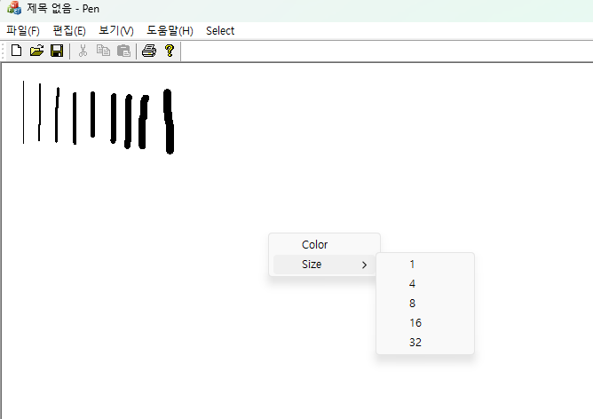
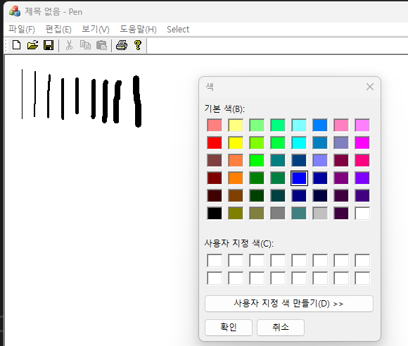
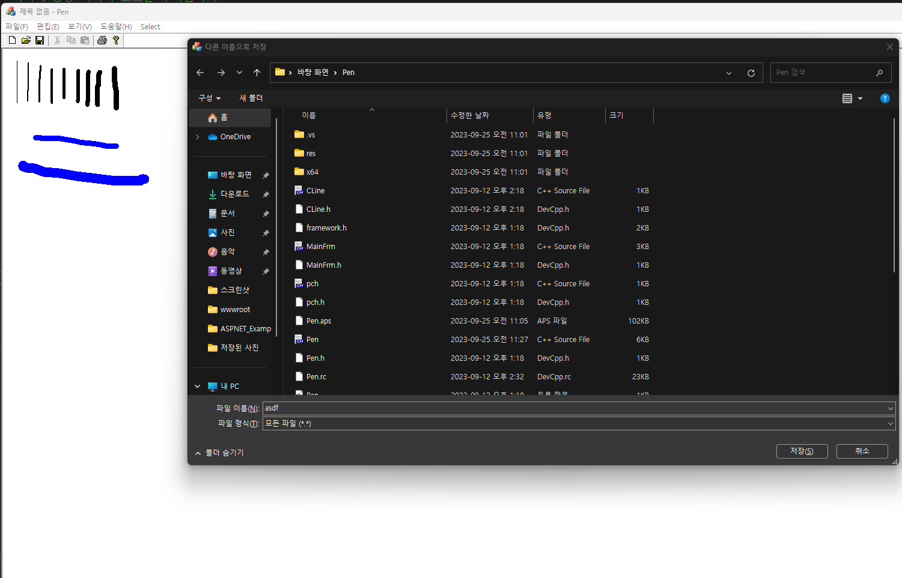
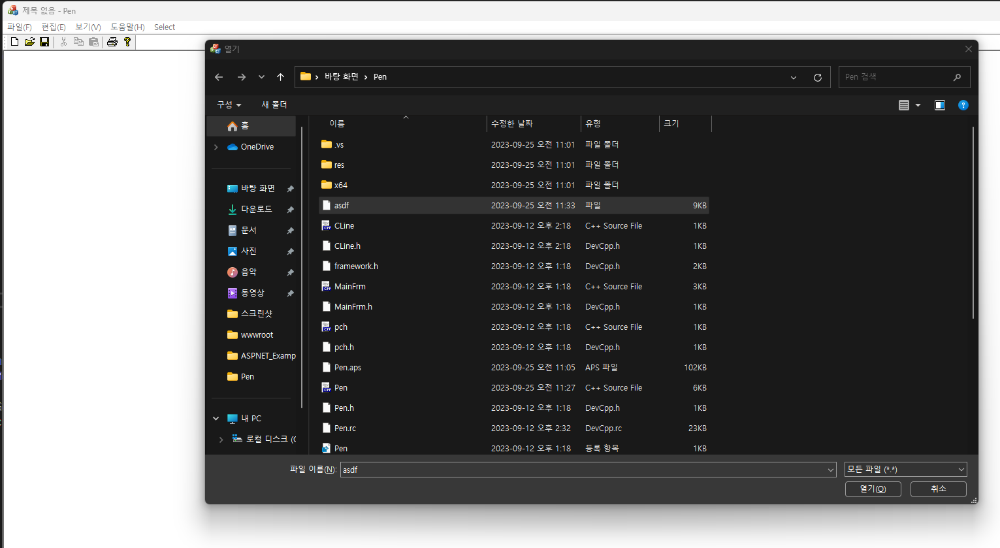

# Test


20191276 컴퓨터공학과 양용석


```
//펜의 굵기를 선택해서 설정 및 색상 선택 기능
void CPenView::OnSelectColor()
{
	CColorDialog dlg;
	if (dlg.DoModal() == IDOK) {
		Col = dlg.GetColor();
	}
	// TODO: 여기에 명령 처리기 코드를 추가합니다.
}
void CPenView::OnSize1()
{
	Size = 1;
	// TODO: 여기에 명령 처리기 코드를 추가합니다.
}
void CPenView::OnSize4()
{
	// TODO: 여기에 명령 처리기 코드를 추가합니다.
	Size = 4;
}
void CPenView::OnSize8()
{
	// TODO: 여기에 명령 처리기 코드를 추가합니다.
	Size = 8;
}
void CPenView::OnSize16()
{
	// TODO: 여기에 명령 처리기 코드를 추가합니다.
	Size = 16;
}
void CPenView::OnSize32()
{
	// TODO: 여기에 명령 처리기 코드를 추가합니다.
	Size = 32;
```


```
//파일 저장 및 불러오기 기능
#include "pch.h"
#include "CLine.h"

IMPLEMENT_SERIAL(CLine, CObject, 1)

void CLine::Serialize(CArchive& ar)
{
	if (ar.IsStoring())
	{	// storing code
		ar << m_From << m_To << m_Size << m_Col;
	}
	else
	{	// loading code
		ar >> m_From >> m_To >> m_Size >> m_Col;
	}
}
```

```
//마우스 우클릭으로 컨텍스트 메뉴를 열어 색상/굵기 선택 기능
void CPenView::OnContextMenu(CWnd* pWnd, CPoint point)
{
	CMenu m;
	m.LoadMenu(IDR_MAINFRAME);
	CMenu* p;
	p = m.GetSubMenu(4);
	p->TrackPopupMenu(TPM_RIGHTBUTTON, point.x, point.y, this);
}
```

```
//클래스 마법사로 PretranslateMessage 함수 추가 후 키보드 입력에 따라 펜의 굵기 변경
BOOL CPenView::PreTranslateMessage(MSG* pMsg)
{
		// TODO: 여기에 특수화된 코드를 추가 및/또는 기본 클래스를 호출합니다.
		if (pMsg->message == WM_KEYDOWN) {
	    if (pMsg->wParam == '1') { Size = 1;return true; }
			if (pMsg->wParam == '2') { Size = 2;return true; }
			if (pMsg->wParam == '3') { Size = 3;return true; }
			if (pMsg->wParam == '4') { Size = 4;return true; }
			if (pMsg->wParam == '5') { Size = 5;return true; }
			if (pMsg->wParam == '6') { Size = 6;return true; }
			if (pMsg->wParam == '7') { Size = 7;return true; }
			if (pMsg->wParam == '8') { Size = 8;return true; }
			if (pMsg->wParam == '9') { Size = 9;return true; }
		}
	return CView::PreTranslateMessage(pMsg);
```
실행 화면</br>

</br>
</br>
</br>
</br>
